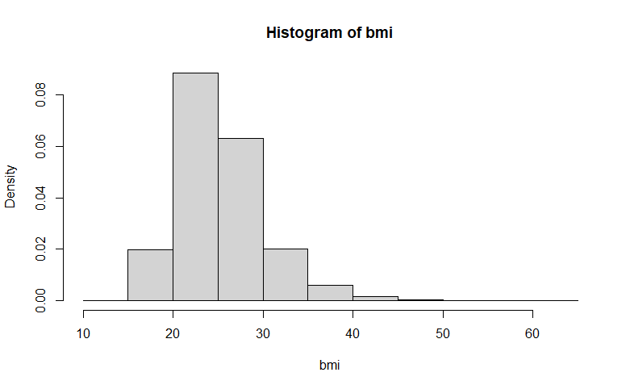
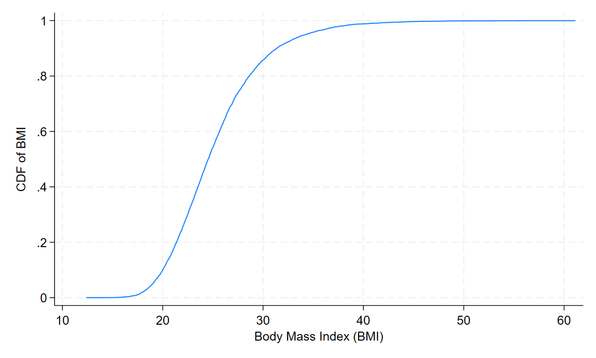

# Analysis of Complex Health Survey Data
# ICHPS 2020

This tutorial will provide some examples of analysis of complex survey
data using both Stata and R code, with parallel examples to the extent
that functionality is similar between the two.

## Source data

We will be using an excerpt from NHANES II that is distributed by Stata Corp.
to run their survey examples off. I am using the locally stored file;
a stable url for the file is 
[http://www.stata-press.com/data/r12/nhanes2.dta](http://www.stata-press.com/data/r12/nhanes2.dta).

The Stata bit:

{{1}}

The R bit:

{{r1}}

In this data set, the high blood pressure variable was miscoded, and it needs
to be fixed.

The Stata bit:

{{2}}

The R bit:

{{r2}}

## Specifying the complex sampling design

The specification of the sampling design for this data set should include:

* the stratification variable is `strata` (runs from 1 to 32; one value skipped)

* the PSU varaible is `psu` (coded 1 and 2, nested within `strata`)

* the weight variable `finalwgt`

The Stata bit:

{{3}}

This is a data set with {{.4}} observations, organized in {{.5}} PSUs nested in {{.6}} strata.

The R bit:

{{r3}}

This is a data set with {{r.4}} observations, organized in {{r.5}} PSUs nested in
{{r.6}} strata.

## One-way tabulation: proportions and counts

The Stata bit: compare the formal estimation command `prop` (short for `proportion`)
and the summary command `tab` (short for `tabulate`).

{{7}}

High design effects for race are produced by two design features. First, the cluster nature of the design
interacted with racial segregation that was typical in the U.S. in 1980s when NHANES II data were collected.
Apparently, geographic areas corresponding to clusters were relatively homogeneous with respect to race,
producing high intraclass correlations (see slide 26). The lower design effect for the blacks is explained
by oversampling: there were more blacks in the sample that would have been expected from a simple random sample.
(Technically, sampling by race isn't possible, as this information is not available on the frame; however, given
the geographic segregation of the races, sample designers were able to achieve higher sample sizes of blacks
by sampling *areas* where blacks tended to live at higher rates than the white areas.)

Category population totals can be produced with `count` option:

{{8}}

The R bit: all estimation commands in `library(survey)` package
have formula as the first argument and design object as the second argument.
One-way tabulations are run with `svymean()` which produces the category
indicators as needed.

{{r7}}

Category population totals can be produced with `svytotal` function:

{{r8}}

It may be worth looking a little bit deeper into how the survey commands work,
and what they leave behind.

Stata stores estimation result components: the coefficient estimates vector
`e(b)` (whose components can be referred to as `_b[coefficient_name]`)
and `e(V)`, as well the various bits of information on the design, such as 
the number of design degrees of freedom `e(df_r)`, estimate of the population
size `e(N_pop)`, and others:

{{9}}

Stata also allows to easily estimate the design effects for the latest estimated
survey command:

{{10}}

A somewhat obscure exception is `svy: tabulate`. Stata pretends this is not
an estimation command, but in fact it has most of the components. The estimates
can be referred to as `_b[prc]` where `r` is the row and `c` is the column.

{{11}}

In R, the best way to get the components of the survey estimation results out
is by the corresponding class methods:

{{r9}}

## Two-way tabulations

The primary methodological complication with two-way tabulations is the distribution 
of the goodness of fit/independence test. (The null hypothesis is that the margins
of the table are independent of one another.) With i.i.d. data, the asymptotic distribution
of the Pearson test of the differences between expected and observed counts is $\chi^2$.
With survey data, the distribution is a sum of $\chi^2_1$, with weights determined
by the generalized design effects (eigenvalues of the diagonal matrix which is the product
of the design-based variance-covariance matrix of estimated counts times the inverse of 
the SRS-based variance-covariance matrix). This is a non-standard distribution, with
the most common approximation being the Satterthwaite moment approximation yielding
a $\chi^2$ or an F distribution with fractional degrees of freedom.

The Stata bit:

{{12}}

Note the fractional degrees of freedom: {{.13}} in the numerator, which is the
approximation for two degrees of freedom that an i.i.d. Pearson test would have had;
and {{.14}} which is a midpoint of kinds between the design degrees of freedom, {{.15}},
and the nominal sample size, {{.16}}. Uncorrected chi-square is useless.

The column/row proportions can be easily requested with the `col` or `row` options:

{{17}}

Totals can be requested with the `count` option (some degree of formatting may be recommended for large
numbers; `format(%9.0fc)` requests nine digits, with millions and thousands separated by commas,
and no digits after the decimal point):

{{18}}

The R bit:

{{r10}}

The results are reported on the scale of weighted totals. The $\chi^2$ statistic needs to be requested
separately:

{{r11}}

The `survey` package in R provides for a variety of ways to compute the tail probabilities
of the asymptotic distribution of the goodness of fit/independence test.

{{r12}}

Note that the Stata results are reproduced by `svychisq(...,statistic="F")` specification.

If you need the tabulation in terms of cell proportions, `svymean` with `~interaction()` formula
can be used:

{{r13}}

Finally, for the row proportions, the best choice is `svyby()` function which acts in `apply`-like fashion
over subsets of the data:

{{r14}}

## Summaries for continuous variables

Stata bit: moments can be estimated using `mean`:

{{19}}

As covariances between estimates are properly computed,
contrasts and other linear combinations can be produced with `lincom` command:

{{20}}

Distribution histogram:

{{21}}

R bit:

{{r15}}

Distribution histogram (in base R graphics):

{{r16}}

## Quantiles and CDFs

In terms of survey statistics, a cdf is a gynormous infinite collection of proportion estimates.
Quantiles are even worse; they are defined by estimating equations
$$
    \theta_p : \mathbf{E} 1\{ X \le \theta_p \} = p
$$
Getting standard errors for these requires inverting the non-smooth step function, 
which has a host of technical difficulties concering regularity conditions on the sampling design.

In Stata, no standard tools for the job are available. Here's reasonably efficient code to produce the CDF.

{{22}}

Estimation of percentiles accounting for the complex survey design is accomplished by user-written
command `epctile`:

{{23}}

R bit: in R, everything is appropriately internalized by the `survey` package:

{{r17}}

## Singleton PSUs

A complication that is very particular to the analysis of survey data is that of single PSU per stratum.
If you study the variance expression on slide 25 of the handouts, you will see that when nh 
is 1, then the variance has the form of 0/0: in the numerator, the stratum mean is equal to the mean in the single unit
in that stratum, while the denominator has nh-1=0. It appears appropriate that variance estimation
procedures produce a reasonably informative error.

By default, Stata produces a missing standard error:

{{24}}

Note the message at the bottom. The issue can be further explored with `svydescribe`:

{{25}}

Stata identified and reported {{.26}} strata in which only one PSU with nonmissing `hdresult` data were available.
(Substantively, NHANES II uses both self-reported data and, more importantly, the biospecimen measurements and instrument data.
If the equipment is malfunctioning, the problem may affect the whole cluster where the data are collected over a period of several
weeks.)

R appears to gloss over the issue in this situation:

{{r18}}

This behavior seems to be equivalent to the following specificaiton in Stata, where `subpop()` option is discussed
in the next section.

{{27}}

That is to say, in the original example with missing standard errors, Stata applied the casewise deletion within the `mean` 
commmand itself, presenting `svy` with a deficient data set that had singleton PSUs. The second specification, however,
starts by subsetting the data in the way that is appropriate for `svy`, and then providing the thus filtered subset to 
the `mean` command. In R, `survey::svymean()` does the latter in a natural way.

## Subpopulations/domains

Estimation of subpopulations/domains presents additional challenges, as the sample sizes
are random variables, and that randomness needs to be taken into account. Restricting the data
set first, and then running survey estimation, may produce weird results, including singleton PSU
discussed above that would be carved out by the domain.

The Stata bit: use `svy, subpop():` option (note that it goes before the colon), or use
`over()` option of the estimation commands if estimates for all domains defined by a categorical
variable are needed. The results are numerically identical.

{{28}}

The R bit: estimation for subpopulations/domains is carried out by `svyby()`, which was used 
earlier in the context of cross-tabulations.

{{r19}}

## Linear models

The Stata bit: provide `svy` prefix; you can use `test` command to tests coefficients, as with the "flat" regression.

{{29}}

The R bit:

{{r20}}

There are differences in how the two packages deal
with the denominator degrees of freedom of the restriction test: Stata uses design degrees of freedom minus the number of tested
parameters, while R, arguably more appropriately, uses residual degrees of freedom (the design degrees
of freedom minus the number of estimated parameters).

Regression diagnostics, such as influential points, should account for the idiosyncracies 
of complex survey data analysis, such as use of weights in defining residuals, or the risks
of producing singleton PSUs when producing leave-one-out diagnostics.
This is currently an area of active methodological research; see `library(svydiags)` in R.

## Logistic regression models

The Stata bit:

{{30}}

Stata can report Archer-Lemeshow goodness of fit test for this regression (the survey-corrected
analogue of Hosmer-Lemeshow test):

{{31}}

The R bit: provide `family=binomial()` parameter of `svyglm`.

{{r21}}

There are differences in how the two packages deal
with the denominator degrees of freedom of the restriction test: Stata uses design degrees of freedom minus the number of tested
parameters, while R, arguably more appropriately, uses residual degrees of freedom (the design degrees
of freedom minus the number of estimated parameters).

A version of this regression in relative risks can be specified as a logistic regression with a log link,
rather than a logit link. In Stata, this can be specified explicitly:

{{32}}

In R, the analogue is not straightforward. The precanned family in the `glm` function is `quasibinomial`, but it produces
vastly different results:

{{r22}}

These results do match Stata with the explicit specification of the Poisson model:

{{33}}

## Troubleshooting

In Stata, the most common problem will likely be the lack of support by `svy` of your favorite command.
For instance, correlation is not going to work, because Stata treats it as a descriptive rather than as an estimation command:

{{34}}

You will also encounter missing standard errors because of singleton PSUs from time to time; these would either be
consequences of missing data, or an incorrect use of `if` restriction in the command after the colon (instead of the part
of `subpop()` option of `svy` before the colon).

In R, the common problems may include:

1. missing data in the analysis variables: the `survey` package freaks out right away, which can be overriden with the standard
`na.rm=TRUE` option of most command:

{{r23}}

2. Giving the variable name without the formula `~`:

{{r24}}

3. Trying to provide the raw data rather than the complex survey design object:

{{r25}}

Of course, the greatest user error would be analysis without survey specifications. As discussed in the workshop presentation,
slides 24--28, both point estimates and standard errors are most likely to be wrong when the complex survey design features
are ignored in the analysis.

## Contact

Stas Kolenikov, skolenik at gmail.

## Markdown

This tutorial was prepared using Germán Rodríguez' `markstat` Stata command
that can produce dynamic documents that combine both R and Stata code using
basic markdown formatting.
See [Stata markdown webpage](http://data.princeton.edu/stata/markdown).
R has an independent implementation of markdown via 
[`rmarkdown` package](https://rmarkdown.rstudio.com). 

To reproduce in Stata:

1. Install `markstat` and `whereis` packages by Germán Rodríguez (`findit markstat` and follow instructions).

2. [Install Pandoc](http://pandoc.org/installing).

3. Inform Stata where Pandoc and R are located (`whereis pandoc *path_to_pandoc.exe*` and `whereis R *path_to_R.exe*`).

4. If that is done, `markstat using survey-ichps2018.stmd, mathjax` should produce a viewable `survey-ichps2018.html` file.
